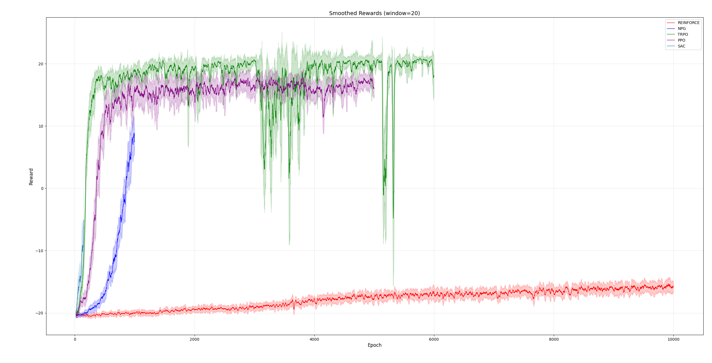

# Advanced Policy Gradient Methods on Atari Pong

This project compares several policy-gradient and actor-critic reinforcement learning algorithms on **Atari Pong**. The implemented methods are:

- **REINFORCE**
- **Natural Policy Gradient (NPG)**
- **Trust Region Policy Optimization (TRPO)**
- **Proximal Policy Optimization (PPO)**
- **Soft Actor-Critic (SAC), discrete-action version**

Unlike the standard pixel-based Atari setup, this project uses a simplified coordinate-based observation extracted from the game screen. Instead of giving the agent raw images, the environment detects the paddle and ball positions and feeds a short history of these coordinates to the policy. This makes the problem less visually heavy and allows us to focus on the optimization behavior of different policy-gradient methods.

---

## Project Structure

| File | Description |
|------|-------------|
| `train_reinforce_pong.py` | REINFORCE training with Monte-Carlo returns |
| `train_naturalpg_pong.py` | Natural Policy Gradient training using Fisher-vector products |
| `train_trpo_pong.py` | TRPO training with conjugate gradient and KL-constrained update |
| `train_ppo_pong.py` | PPO training with clipped surrogate objective and GAE |
| `train_sac_pong.py` | Discrete SAC training with replay buffer and entropy regularization |
| `results_*` | Output folders with checkpoints, reward histories, losses, and timing logs |

---

## Problem Setup

The environment is based on **Atari Pong**, specifically: `PongNoFrameskip-v4`.


The agent controls one paddle and plays against the built-in Atari opponent. A full game ends when one side reaches the standard Pong terminal score. The reward is sparse:

$$
r_t =
\begin{cases}
+1, & \text{if the agent wins} \\
-1, & \text{if the agent loses} \\
0, & \text{otherwise}
\end{cases}
$$

The total episode return is therefore equals the score difference:

$$
G = \sum_{t=0}^{T-1} r_t
$$

A strong policy should obtain positive return, while a weak policy remains close to:

$$
G_{min} = -21
$$

because it loses nearly every rally.

---

## Markov Decision Process Formulation

We model the task as a Markov Decision Process:

$$
(\mathcal{S}, \mathcal{A}, \mathcal{P}, \mathcal{R}, \gamma)
$$

where:

- $\mathcal{S}$ is the state space,
- $\mathcal{A}$ is the action space,
- $\mathcal{P}(s_{t+1}|s_t,a_t)$ is the transition function,
- $\mathcal{R}(s_t,a_t)$ is the reward function,
- $\gamma \in [0,1]$ is the discount factor.

The objective is to find a policy $\pi_\theta(a|s)$ maximizing the expected return:

$$
J(\theta)=\mathbb{E}_{\tau \sim \pi_\theta}\left[\sum_{t=0}^{T-1}\gamma^t r_t\right]
$$

where a trajectory is:

$$
\tau=(s_0,a_0,r_0,s_1,a_1,r_1,\dots,s_T)
$$

---

## State Space

Instead of using raw Atari frames, we use a coordinate extractor. At each environment step, the RGB frame is scanned to detect:

- the agent paddle location,
- the ball location.

The extracted coordinates are normalized to $[0,1]$.

The basic coordinate vector is:

$$
c_t =
\begin{bmatrix}
y^{paddle}_t \\
x^{ball}_t \\
y^{ball}_t
\end{bmatrix}
\in [0,1]^3
$$

To preserve velocity-like information, the observation stacks the last four coordinate vectors:

$$
s_t =
\begin{bmatrix}
c_{t-3} \\
c_{t-2} \\
c_{t-1} \\
c_t
\end{bmatrix}
$$

Thus, the state dimension is:

$$
\mathcal{S} \subseteq [0,1]^{12}
$$

This gives the policy enough information to infer approximate ball velocity without using a CNN.

---

## Action Space

Atari Pong exposes six discrete actions:

$$
\mathcal{A}=\{0,1,2,3,4,5\}
$$

These correspond to the Atari action set, including actions such as no-op, fire, up, down, and redundant movement actions depending on the ALE interface.

The policy is categorical:

$$
a_t \sim \pi_\theta(\cdot|s_t)
$$

with:

$$
\pi_\theta(a|s)=\text{Categorical}(\text{softmax}(f_\theta(s)))
$$

where $f_\theta(s)$ is the neural network outputting logits for all actions.

---

## Transition Function

The transition function is inherited from the Atari emulator:

$$
s_{t+1} \sim \mathcal{P}(\cdot|s_t,a_t)
$$

Internally, the true emulator state contains the full Pong game state. Our wrapper observes only extracted coordinates. 

---

## Reward Function

The reward is the Atari Pong rally reward:

$$
r_t =
\begin{cases}
+1, & \text{agent scores} \\
-1, & \text{opponent scores} \\
0, & \text{game is still ongoing}
\end{cases}
$$

The return from time $t$ is:

$$
G_t=\sum_{k=t}^{T-1}\gamma^{k-t}r_k
$$

We use $\gamma=0.99$, so later rewards are slightly discounted while still keeping long-term rally outcomes important.

---

## Policy Network

All methods use an MLP policy network on the coordinate observation. The common actor structure is:

$$
s_t \rightarrow \text{Linear} \rightarrow \text{ReLU} \rightarrow \text{Linear} \rightarrow \text{logits}
$$

The output logits parameterize a categorical distribution:

$$
\pi_\theta(a|s)=\frac{\exp(z_a)}{\sum_{a'\in\mathcal{A}}\exp(z_{a'})}
$$

where:

$$
z=f_\theta(s)
$$

For PPO, an additional value head is used:

$$
V_\phi(s)
$$

For SAC, two Q-functions are used:

$$
Q_{\psi_1}(s,a), \quad Q_{\psi_2}(s,a)
$$

---

# Methods

## 1. REINFORCE

REINFORCE is the vanilla Monte-Carlo policy-gradient algorithm.

The policy-gradient theorem gives:

$$
\nabla_\theta J(\theta)
=
\mathbb{E}_{\pi_\theta}
\left[
G_t \nabla_\theta \log \pi_\theta(a_t|s_t)
\right]
$$

The implemented loss is:

$$
\mathcal{L}_{REINFORCE}(\theta)
=
-\sum_{t=0}^{T-1}G_t\log \pi_\theta(a_t|s_t)
$$

The parameters are updated with Adam:

$$
\theta \leftarrow \theta - \alpha \nabla_\theta \mathcal{L}_{REINFORCE}(\theta)
$$

### Comments

REINFORCE has high variance because every action in a trajectory receives credit only through the sampled return. In Pong, rewards are sparse and delayed, so this method **improves slowly**.

---

## 2. Natural Policy Gradient

Natural Policy Gradient modifies the vanilla gradient step by accounting for the geometry of the policy distribution.

The standard gradient is:

$$
g=\nabla_\theta J(\theta)
$$

The natural gradient direction is:

$$
\tilde{g}=F(\theta)^{-1}g
$$

where $F(\theta)$ is the Fisher Information Matrix:

$$
F(\theta)
=
\mathbb{E}_{s,a\sim\pi_\theta}
\left[
\nabla_\theta \log \pi_\theta(a|s)
\nabla_\theta \log \pi_\theta(a|s)^T
\right]
$$

Equivalently, the Fisher matrix can be obtained from the local curvature of the KL divergence:

$$
F(\theta)
=
\nabla_\theta^2
D_{KL}
\left(
\pi_{\theta_{old}}(\cdot|s)
\|
\pi_\theta(\cdot|s)
\right)
$$

The update is:

$$
\theta_{new}
=
\theta
+
\eta F^{-1}g
$$

In the implementation, the inverse Fisher product is computed approximately using conjugate gradient. The step size is scaled to satisfy an approximate KL bound:

$$
\eta
=
\sqrt{
\frac{2\epsilon}
{\tilde{g}^T F \tilde{g}}
}
$$

so:

$$
\theta_{new}
=
\theta
+
\eta \tilde{g}
$$

### Comments

NPG improved **much faster than REINFORCE** in the experiments, but its run in the plot is shorter than the longest runs. It reached positive reward, showing that geometry-aware updates are useful for this problem.

---

## 3. Trust Region Policy Optimization

TRPO improves policy-gradient training by explicitly constraining how much the new policy can move away from the old policy.

The surrogate objective is:

$$
L_{\theta_{old}}(\theta)
=
\mathbb{E}
\left[
\frac{\pi_\theta(a_t|s_t)}
{\pi_{\theta_{old}}(a_t|s_t)}
A_t
\right]
$$

and $A_t$ is an advantage estimate.

The constrained optimization problem is:

$$
\max_\theta
\mathbb{E}
\left[
\frac{\pi_\theta(a_t|s_t)}
{\pi_{\theta_{old}}(a_t|s_t)}A_t
\right]
$$

subject to:

$$
\mathbb{E}
\left[
D_{KL}
\left(
\pi_{\theta_{old}}(\cdot|s_t)
\|
\pi_\theta(\cdot|s_t)
\right)
\right]
\leq \delta
$$

The implementation computes:

$$
Fv
=
\nabla_\theta^2D_{KL}(\pi_{\theta_{old}},\pi_\theta)v
$$

without forming the full Fisher matrix. Then conjugate gradient approximates:

$$
F^{-1}g
$$

A backtracking line search accepts the update only if the KL constraint is satisfied and the surrogate objective improves.

### Comments

TRPO was probably the **strongest method** in the final comparison. It reached the highest smoothed reward, although occasional sharp drops appeared during training.

---

## 4. Proximal Policy Optimization

PPO replaces the hard TRPO trust-region constraint with a simpler clipped objective.

The probability ratio is:

$$
r_t(\theta)
=
\frac{\pi_\theta(a_t|s_t)}
{\pi_{\theta_{old}}(a_t|s_t)}
$$

The clipped objective is:

$$
L_{CLIP}(\theta)
=
\mathbb{E}
\left[
\min
\left(
r_t(\theta)A_t,
\text{clip}(r_t(\theta),1-\epsilon,1+\epsilon)A_t
\right)
\right]
$$

The PPO loss is minimized as:

$$
\mathcal{L}_{PPO}
=
-L_{CLIP}
+
c_v\mathcal{L}_V
-
c_e\mathcal{H}(\pi_\theta)
$$

where:

$$
\mathcal{L}_V
=
(V_\phi(s_t)-R_t)^2
$$

and:

$$
\mathcal{H}(\pi_\theta)
=
-\sum_a \pi_\theta(a|s_t)\log \pi_\theta(a|s_t)
$$

The advantage is computed with Generalized Advantage Estimation:

$$
\delta_t
=
r_t+\gamma V(s_{t+1})-V(s_t)
$$

$$
A_t^{GAE}
=
\sum_{l=0}^{T-t-1}
(\gamma\lambda)^l\delta_{t+l}
$$

### Comments

PPO achieved strong positive returns, although below TRPO in the final plot. It was easier to train than TRPO because it avoids explicit Fisher-vector computations and line search, giving **stable objective growth**.

---

## 5. Soft Actor-Critic for Discrete Actions

SAC is an off-policy maximum-entropy actor-critic method. It optimizes both reward and entropy:

$$
J(\pi)
=
\mathbb{E}
\left[
\sum_{t=0}^{T-1}
\gamma^t
\left(
r_t+\alpha\mathcal{H}(\pi(\cdot|s_t))
\right)
\right]
$$

For discrete actions, the soft value is:

$$
V(s)
=
\sum_a
\pi(a|s)
\left[
Q(s,a)-\alpha\log\pi(a|s)
\right]
$$

The critic target is:

$$
y_t
=
r_t
+
\gamma(1-d_t)
\sum_{a'}
\pi(a'|s_{t+1})
\left[
\min_i Q_{\psi_i}^{target}(s_{t+1},a')
-
\alpha\log\pi(a'|s_{t+1})
\right]
$$

The critic loss is:

$$
\mathcal{L}_Q
=
\sum_{i=1}^{2}
\left(
Q_{\psi_i}(s_t,a_t)-y_t
\right)^2
$$

The actor loss is:

$$
\mathcal{L}_\pi
=
\mathbb{E}_{s}
\left[
\sum_a
\pi_\theta(a|s)
\left(
\alpha\log\pi_\theta(a|s)
-
\min_i Q_{\psi_i}(s,a)
\right)
\right]
$$

The entropy coefficient $\alpha$ is also learned automatically.

### Comments

SAC performance highly depends on the gradient steps done per epoch. With 10 gradient steps per epoch, it trains faster (in epochs) than all other methods. However, it was long computationally, so not trained until the end. This is a **powerful method for optimizing objective when trajectory sampling is costly**, due to tunable gradient steps over the stored replay buffer.

---

# Training

Each script can be launched independently. The general training structure is the same across methods:

1. create the Pong environment;
2. initialize the policy or actor-critic model;
3. collect trajectories or transitions;
4. compute the corresponding objective;
5. update the model parameters;
6. save checkpoints and reward histories.

---

## REINFORCE

```bash
python train_reinforce_pong.py --epochs 10000 --episodes 20 --gamma 0.99 --lr 3e-4
```

---

## Natural Policy Gradient

```bash
python train_naturalpg_pong.py --epochs 1000 --episodes 20 --gamma 0.99 --epsilon 1e-2 --lr 3e-4
```

---

## TRPO

```bash
python train_trpo_pong.py --epochs 6000 --episodes 20 --gamma 0.99 --lr 3e-4
```

---

## PPO

```bash
python train_ppo_pong.py --epochs 5000 --episodes 20 --gamma 0.99 --lam 0.99 --lr 3e-4
```

---

## SAC

```bash
python train_sac_pong.py --total_steps 1000000 --learning_starts 5000 --batch_size 100 --lr 3e-4 --gradient_steps 10
```

---

## Checkpointing

To resume training, pass a checkpoint path:

```bash
python train_ppo_pong.py \
    --epochs 5000 \
    --episodes 20 \
    --checkpoint_path results_ppo/checkpoint_1000epoch_20ep.pt
```

---

# Results

The following plot compares smoothed rewards for all five methods.



The smoothed reward curves show the following behavior:

| Method | Result Summary |
|--------|----------------|
| **REINFORCE** | **Very slow** improvement. It remains negative even after many epochs. |
| **NPG** | Learns much **faster than REINFORCE** and reaches positive rewards in fewer epochs. |
| **TRPO** | **Best-performing** method. It reaches around $+20$ smoothed reward and stays near the top. |
| **PPO** | **Stable strong improvement**, stabilizing around $+15$ to $+17$ reward. |
| **SAC** | **Fastest in epochs** due to multiple gradient steps per epoch. |

---

# Conclusion

This project demonstrates the practical differences between several policy-gradient algorithms on a simplified Atari Pong task.

The main conclusions are:

1. **Vanilla REINFORCE is not enough** for reliable Pong learning under sparse delayed rewards.
2. **Natural gradients significantly improve learning speed** by using policy geometry.
3. **TRPO gives the strongest performance** among the tested methods.
4. **PPO is a most stable strong practical compromise**, achieving good results with simpler implementation than TRPO.
5. **SAC is fastest in epochs**, best solution for costly trajectories.
